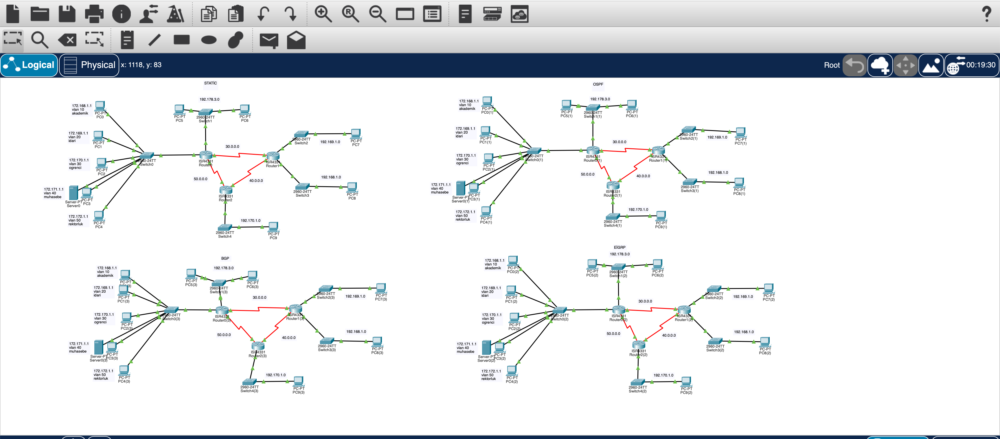

# 🌐 Cisco Packet Tracer — Routing Protocols Comparison



> **A comparative network simulation project** implementing Static Routing, OSPF, EIGRP, and BGP on identical topologies using Cisco Packet Tracer, with Inter-VLAN Routing and centralized DHCP.

---

## 📌 Table of Contents

- [About the Project](#-about-the-project)
- [Features](#-features)
- [Topology Overview](#-topology-overview)
- [VLAN Design](#-vlan-design)
- [Routing Protocols](#-routing-protocols)
- [Configuration Examples](#️-configuration-examples)
- [Repository Structure](#-repository-structure)
- [Technologies Used](#-technologies-used)
- [Getting Started](#-getting-started)
- [Author](#-author)

---

## 📖 About the Project

This project was developed to **compare four different routing protocols** side-by-side using identical network topologies in Cisco Packet Tracer. Each scenario uses the same physical layout but applies a different routing method, allowing direct comparison of convergence behavior, configuration complexity, and scalability.

The project simulates a **university campus network** with multiple departments interconnected via VLANs, WAN serial links (ISR 4331 routers), and a centralized DHCP server.

---

## 🚀 Features

| Feature | Description |
|---|---|
| **4 Routing Scenarios** | Static, OSPF (Area 0), EIGRP (AS 100), BGP (EBGP AS 1/2/3) |
| **Inter-VLAN Routing** | Router-on-a-Stick via IEEE 802.1Q subinterfaces |
| **Centralized DHCP** | All end devices receive IPs from Server0 via `ip helper-address` |
| **WAN Links** | Serial connections using ISR 4331 with DCE/DTE clock rate |
| **5 VLANs** | Departments: Academic, Administrative, Students, Accounting, Rectorate |
| **Scalable Design** | Each topology is self-contained and independently testable |

---

## 🗺 Topology Overview

Each of the four scenarios follows this structure:

```
[End Devices] ──► [Access Switch] ──► [Distribution Switch]
                                              │
                                         [Router0] (ISR 4331)
                                         /        \
                                   30.0.0.0     50.0.0.0
                                       │              │
                                   [Router1]     [Router2]
                                   /      \
                             40.0.0.0   192.168.x.0
                                 │
                            [Router3] ──► [Switches] ──► [PCs]
```

- **Switch models:** Cisco 2960-24TT
- **Router models:** Cisco ISR 4331
- **WAN addressing:** Class A (`30.0.0.0`, `40.0.0.0`, `50.0.0.0`)
- **LAN addressing:** Class C per VLAN (see table below)

---

## 🗂 VLAN Design

| Department | VLAN ID | Network Address | Gateway |
|---|---|---|---|
| Akademik (Academic) | VLAN 10 | `172.168.1.0/24` | `172.168.1.1` |
| İdari (Administrative) | VLAN 20 | `172.169.1.0/24` | `172.169.1.1` |
| Öğrenci (Students) | VLAN 30 | `172.170.1.0/24` | `172.170.1.1` |
| Muhasebe (Accounting/Server) | VLAN 40 | `172.171.1.0/24` | `172.171.1.1` |
| Rektörlük (Rectorate) | VLAN 50 | `172.172.1.0/24` | `172.172.1.1` |

> **DHCP Server (Server0)** is located in VLAN 40 at `172.171.1.2` and serves all VLANs via `ip helper-address`.

---

## 🔀 Routing Protocols

### 1. 📍 Static Routing
Manual route entries on each router. Best for understanding fundamental routing logic. No dynamic updates — any topology change requires manual intervention.

**Pros:** Simple, predictable, zero overhead  
**Cons:** Not scalable, no automatic failover

---

### 2. 🔄 OSPF (Open Shortest Path First) — Area 0
Link-state protocol using Dijkstra's algorithm. All routers are placed in **backbone Area 0**.

**Pros:** Fast convergence, hierarchical design, open standard  
**Cons:** Higher memory/CPU usage, complex configuration in large networks

---

### 3. ⚡ EIGRP (Enhanced Interior Gateway Routing Protocol) — AS 100
Cisco proprietary (now open) hybrid protocol using DUAL algorithm for loop-free paths.

**Pros:** Very fast convergence, low bandwidth usage, supports unequal-cost load balancing  
**Cons:** Historically Cisco-only, less common in multi-vendor environments

---

### 4. 🌍 BGP (Border Gateway Protocol) — EBGP
Exterior BGP configured across **three autonomous systems (AS 1, AS 2, AS 3)**, simulating internet-scale routing.

**Pros:** Highly scalable, policy-based routing, industry standard for ISPs  
**Cons:** Slow convergence, complex configuration, designed for inter-AS routing

---

## ⚙️ Configuration Examples

### Inter-VLAN Subinterfaces + DHCP Relay (Router0)

```cisco
! VLAN 10 — Academic
interface GigabitEthernet0/0/0.10
 encapsulation dot1Q 10
 ip address 172.168.1.1 255.255.255.0
 ip helper-address 172.171.1.2

! VLAN 20 — Administrative
interface GigabitEthernet0/0/0.20
 encapsulation dot1Q 20
 ip address 172.169.1.1 255.255.255.0
 ip helper-address 172.171.1.2

! VLAN 30 — Students
interface GigabitEthernet0/0/0.30
 encapsulation dot1Q 30
 ip address 172.170.1.1 255.255.255.0
 ip helper-address 172.171.1.2

! VLAN 40 — Accounting/Server
interface GigabitEthernet0/0/0.40
 encapsulation dot1Q 40
 ip address 172.171.1.1 255.255.255.0
 ip helper-address 172.171.1.2

! VLAN 50 — Rectorate
interface GigabitEthernet0/0/0.50
 encapsulation dot1Q 50
 ip address 172.172.1.1 255.255.255.0
 ip helper-address 172.171.1.2
```

### WAN Serial Link

```cisco
interface Serial0/1/0
 ip address 30.0.0.1 255.0.0.0
 clock rate 64000
 no shutdown
```

### Static Routing Example

```cisco
ip route 192.169.1.0 255.255.255.0 30.0.0.2
ip route 192.168.1.0 255.255.255.0 40.0.0.2
ip route 192.170.1.0 255.255.255.0 50.0.0.2
```

### OSPF Configuration

```cisco
router ospf 1
 network 172.168.1.0 0.0.0.255 area 0
 network 172.169.1.0 0.0.0.255 area 0
 network 30.0.0.0 0.255.255.255 area 0
```

### EIGRP Configuration

```cisco
router eigrp 100
 network 172.168.1.0 0.0.0.255
 network 172.169.1.0 0.0.0.255
 network 30.0.0.0 0.255.255.255
 no auto-summary
```

### BGP Configuration (AS 1 → AS 2)

```cisco
router bgp 1
 neighbor 30.0.0.2 remote-as 2
 network 172.168.1.0 mask 255.255.255.0
 network 172.169.1.0 mask 255.255.255.0
```

### Switch — Trunk & Access Ports

```cisco
! Trunk port toward router
interface FastEthernet0/1
 switchport mode trunk

! Access port for VLAN 10
interface FastEthernet0/2
 switchport mode access
 switchport access vlan 10
```

---

## 🖼 Screenshots

### Full Topology Overview


### Static Routing


### OSPF


### EIGRP


### BGP


> 📁 Add your Packet Tracer screenshots to the `screenshots/` folder and they will appear here automatically.

---

## 📂 Repository Structure

```
cisco-routing-protocols/
│
├── Static_Routing.pkt          # Static route configuration
├── OSPF_Routing.pkt            # OSPF Area 0 configuration
├── EIGRP_Routing.pkt           # EIGRP AS 100 configuration
├── BGP_Routing.pkt             # EBGP AS 1/2/3 configuration
│
├── screenshots/
│   └── topology_overview.png   # Full topology screenshot
│
└── README.md
```

---

## 🛠 Technologies Used

- **Cisco Packet Tracer** — Network simulation platform
- **Cisco ISR 4331** — Main routing devices
- **Cisco 2960-24TT** — Layer 2 access/distribution switches
- **IEEE 802.1Q** — VLAN trunking (dot1Q encapsulation)
- **Routing Protocols:** Static, OSPFv2, EIGRP, eBGP
- **DHCP Relay** — `ip helper-address` for centralized IP assignment

---

## 🚦 Getting Started

1. Install **[Cisco Packet Tracer](https://www.netacad.com/courses/packet-tracer)** (version 8.x or later recommended)
2. Clone this repository:
   ```bash
   git clone https://github.com/your-username/cisco-routing-protocols.git
   ```
3. Open any `.pkt` file in Packet Tracer
4. Use **Simulation Mode** to observe packet flow and routing behavior
5. Test connectivity with `ping` and `tracert` from end devices
6. Compare convergence times and routing tables across the four scenarios

> **Tip:** Open all four `.pkt` files side by side to directly compare how each protocol populates the routing table (`show ip route`).

---

## 👨‍💻 Author

**Onur**  
Software Engineering Student  
Konya Food and Agriculture University (KFAU / Konya Gıda ve Tarım Üniversitesi)

---

## 📄 License

This project was created for educational purposes. Feel free to use, modify, and share it for learning and academic use.

---

<div align="center">

⭐ If you found this project useful, consider giving it a star!

</div>
